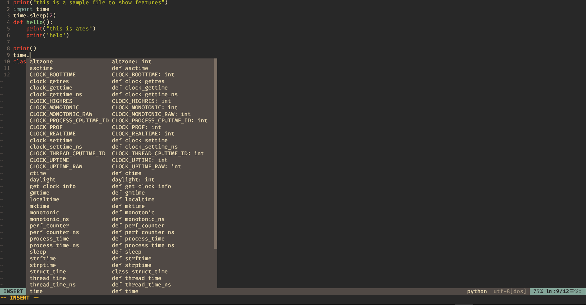

# Python-IDE-with-vim
You might think that your development ENV wouldnt effect much but i am gonna prove you wrong.In this repositorie i am going to share that sweet coconut oil.So lets get star#ted
# Introduction
# Pro's
Autocomplete
Nerdtree for filenavigation
Python mode
Syntax check
Vim airlines
Vim tabline
# Wonderful autocomplete
I use Tabnine and no I am not sponsored. Tabnine is fast and easy to install. I wasted a lost of time installing YouCompletMe.So I recommend tabnine

# Code Folding
Code folding enables us to understand long code properly. This come with most IDE's

# Proper syntax error checking
This prevents us from breaking our heads by checking whats wrong.

# Nerd Tree - file navigation
Nerd Tree is wonderful for file navigation. Most Vim users use it

# Installation

# Windows
Install neovim-qt or neovim-gtk or any other vim GUI.https://github.com/neovim/neovim/releases/ 
The vimrc will be in C:\Users\cukri\AppData\Local\nvim\init.vim
copy the init.vim and paste it inside your init.vim which is in  C:\Users\cukri\AppData\Local\nvim\init.vim.
If you dont know how to do it follow the commands
open your command propt
type in:
cd ~/C:\Users\cukri\AppData\Local\nvim
notepad init.vim
paste in the init.vim from this reposotrie
then open nvim-qt.exe in C:\Users\cukri\nvim\nvim-win64\Neovim\bin\neovim.qt.exe

# Linux
